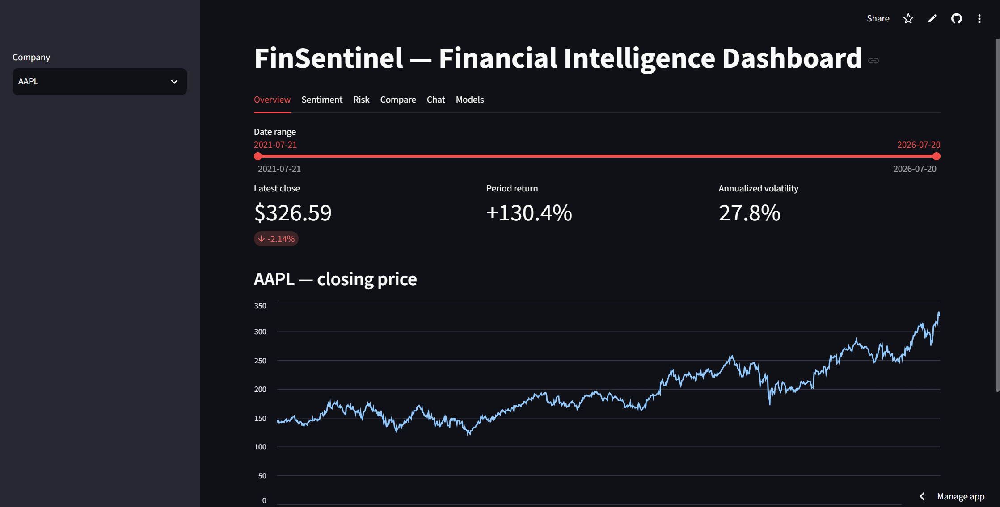
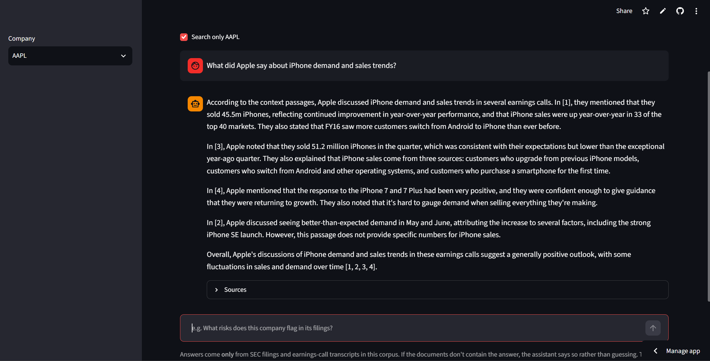
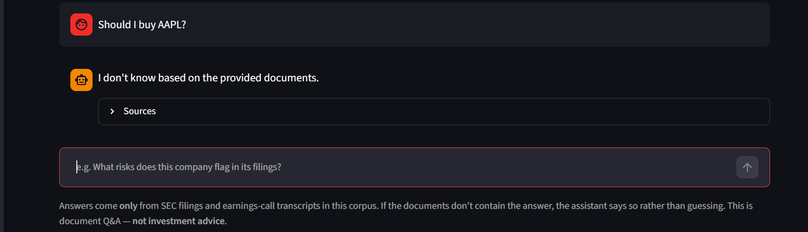
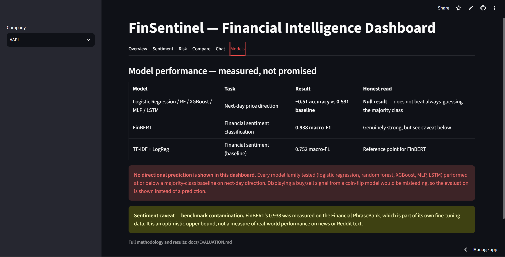

# FinSentinel

**Live app: https://finsentinel-ai-gztatrrh57fz3vedejaxnf.streamlit.app**

A financial analysis tool for ten large US companies. It pulls together stock prices, SEC
filings, financial news, Reddit posts and earnings-call transcripts, runs ML and NLP models
over them, and puts the results behind a dashboard with a chatbot that answers questions
from the filings and cites the passages it used.

The thing I want to say up front: **the stock prediction doesn't work.** I tested five
model families on next-day price direction and none of them beat a coin flip. That's in the
app, in this README, and in the evaluation report, because a project that hides its
negative results isn't worth much. What does work is the document side — sentiment
classification and a retrieval chatbot that answers from real filings and says "I don't
know" when the documents don't cover the question.



---

## Contents

1. [What it does](#what-it-does)
2. [Why I built it](#why-i-built-it)
3. [Status](#status)
4. [The chatbot](#the-chatbot)
5. [Data](#data)
6. [Results](#results)
7. [Limitations](#limitations)
8. [Running it yourself](#running-it-yourself)
9. [Testing](#testing)
10. [Project structure](#project-structure)

---

## What it does

Pick a company and you get six views:

- **Overview** — price history with a date filter, plus latest close, period return and
  annualised volatility for whatever window you select.
- **Sentiment** — how news and Reddit posts about that company were classified by FinBERT,
  with a monthly trend. Labelled with its real date coverage, because the text data is
  historical and would otherwise read as today's market mood.
- **Risk** — a transparent 0–10 financial risk score built from leverage, liquidity,
  profitability, beta and volatility. Price volatility is shown *beside* it rather than
  folded into it (more on why below).
- **Compare** — several companies on one chart, rebased to 100 so you're comparing growth
  rather than share price.
- **Chat** — ask a question, get an answer drawn from that company's filings and earnings
  calls, with the sources listed.
- **Models** — what each model actually scores, including the ones that failed.

## Why I built it

I wanted one project that went the whole distance: raw data through to something a person
can open in a browser. Financial data is a good fit because it's messy, publicly available,
and full of chances to fool yourself — lookahead bias, survivorship bias, metrics that look
impressive and mean nothing.

Partway through I rebuilt how I was working on it. An interview made it obvious that being
able to *build* something isn't the same as being able to *defend* it, so I went back and
added an evaluation report, a test suite, and a rule that every component had to justify why
it existed. A few planned features got cut under that rule, which I think improved the
project more than adding them would have.

## Status

| Component | State |
|---|---|
| Data pipeline (prices, filings, news, Reddit, transcripts) | Done |
| Feature engineering + leakage checks | Done |
| Stock-direction models (LogReg, RF, XGBoost, MLP, LSTM) | Done — **null result** |
| Sentiment classification (TF-IDF baseline + FinBERT) | Done |
| Financial risk score | Done |
| RAG chatbot (chunking → embeddings → FAISS → grounded answers) | Done |
| Test suite (30 tests: unit, data, model, AI-specific) | Done |
| Streamlit dashboard | Done |
| Deployment (Streamlit Community Cloud, Groq backend) | Done — live |
| Named-entity recognition | **Cut** — ticker tagging already solved it |
| FastAPI backend | **Cut** — Streamlit calls the code directly |

The two cut components were dropped on purpose. NER would have duplicated work the ticker
column already did, and a separate API backend would have sat between the dashboard and
functions it can call directly. I'd rather have fewer parts I can explain than more I can't.

## The chatbot



The pipeline is straightforward:

1. **Chunk** — 155 documents (SEC 10-Ks/10-Qs and earnings transcripts) split into 40,219
   pieces of ~800 characters with overlap. That size isn't arbitrary: the embedding model
   reads at most 256 tokens and silently truncates anything longer, so chunks are sized to
   fit inside that limit.
2. **Embed** — each chunk becomes a 384-dimensional vector via `all-MiniLM-L6-v2`,
   normalised so a dot product gives cosine similarity.
3. **Index** — stored in FAISS with the metadata kept in exactly the same order, so a search
   result maps back to the right filing. I verified that alignment rather than assuming it.
4. **Retrieve** — filtered to one company using a FAISS ID selector, then re-ranked with MMR
   so near-identical boilerplate doesn't take up several slots. Filings repeat the same risk
   language year after year; without this, five "sources" could be three ideas.
5. **Answer** — the retrieved passages go into the prompt numbered, and the model is told to
   answer only from them, cite them, and otherwise say it doesn't know.

### The refusal is the point



Most of the effort went into the last step. A financial assistant that invents a number is
worse than one that admits it doesn't know, so I tested that behaviour deliberately with
questions the documents can't answer — a company outside the ten, a forward-looking
forecast, a figure filings don't break out. It refused all of them.

There is no "don't give investment advice" rule anywhere in this code. Asking *"should I buy
AAPL?"* gets refused by the same mechanism as everything else: no filing says whether you
should buy Apple. Grounding handles it for free.

## Data

| Source | Contents | Coverage |
|---|---|---|
| yfinance | Daily OHLCV | 10 tickers, ~5 years, 12,540 rows |
| SEC EDGAR | 10-K / 10-Q filings | 60 filings, all 10 tickers |
| Financial PhraseBank | Labelled sentiment sentences | 3,448 (75% agreement tier) |
| Financial news | Headlines with ticker + date | 14,303 rows, 9 tickers, **2011–2020** |
| Reddit (r/wallstreetbets) | Posts with score + date | 4,072 tagged rows, **Jan–Aug 2021** |
| Earnings transcripts | Call transcripts | 95 files, **5 companies**, 2016–2020 |

Companies: AAPL, MSFT, GOOGL, AMZN, NVDA, TSLA, META, JPM, JNJ, XOM.

## Results



### Stock direction — a null result

| Model | Accuracy | Baseline |
|---|---|---|
| Logistic Regression | ~0.51 | 0.531 |
| Random Forest | ~0.51 | 0.531 |
| XGBoost | ~0.51 | 0.531 |
| MLP | 0.520 | 0.531 |
| LSTM | 0.470 | 0.531 |

Every model performed at or below the majority-class baseline, with ROC-AUC around 0.50.
Walk-forward validation on logistic regression gave 0.502 ± 0.019 — noise.

I also tested whether news sentiment added anything, on the period where price and news data
actually overlap. A single train/test split suggested a +1.6% improvement, which looked
promising until walk-forward validation across five folds returned **−0.0003 ± 0.0158**, and
only 2 of 5 folds improved at all. The apparent gain came from one window that happened to
include March 2020. Hypothesis rejected.

This is the expected outcome. Daily direction from public price history is close to a coin
flip, and I'd be more suspicious of a result that *did* work.

### Sentiment classification — this one works

| Model | Macro-F1 |
|---|---|
| TF-IDF + Logistic Regression | 0.752 |
| FinBERT | **0.938** |

**With a caveat I found myself:** FinBERT was fine-tuned by ProsusAI on the Financial
PhraseBank — the same dataset I evaluated it on. So 0.938 is an optimistic upper bound
measured on its own training distribution, not evidence of real-world performance on news or
Reddit text. The honest claim is "0.938 on PhraseBank", nothing more.

### RAG evaluation

Measured on a 15-question set (12 answerable, 3 deliberately unanswerable but *tempting* —
retrieval returns plausible-looking passages for each):

| Metric | Local (Llama 3.2, 3B) | Deployed (gpt-oss-120b) |
|---|---|---|
| Refusal accuracy on unanswerable questions | 3/3 | **3/3** |
| Citation rate | 9/12 | **12/12** |
| False refusals on answerable questions | 3/12 (25%) | **0/12** |

Retrieval separately scores hits@3 = 1.00 on a 12-question set — which I'd read cautiously,
since every question names its company and 12 questions is a smoke test, not a benchmark.

When I moved inference from a local model to Groq, I re-ran the whole evaluation rather than
assuming the numbers carried over. A provider switch is a model change. The main risk was
that a much larger model would answer out-of-corpus questions from its own world knowledge
instead of refusing — it didn't.

## Limitations

- **Stock prediction does not work here.** Documented, not hidden.
- **Sentiment scores are benchmark-contaminated** (see above) and the text data is
  historical — news ends in 2020, Reddit covers 2021 only. It is not current market mood.
- **No Microsoft news.** That dataset contains zero MSFT rows. The app says so rather than
  showing an empty chart.
- **Transcripts cover 5 of 10 companies** (AAPL, AMZN, GOOGL, MSFT, NVDA).
- **Survivorship bias.** These are ten large, currently-successful firms picked with
  hindsight. Companies that failed over the period are absent, which flatters the results.
- **~8% false refusals.** The chatbot sometimes declines a question it had the context to
  answer. That's the safe direction to fail for a financial tool, but it's a real cost.
- **Speed.** Answers take roughly 20 seconds, and about 45 seconds on the first request after
  the app wakes from sleep. The bottleneck is embedding the query on shared free-tier CPU,
  not the language model, which responds in about 1.5 seconds. I cached the index load
  expecting it to help; measured on the live app, it didn't.
- **Chat history doesn't survive a page refresh.** Session state only.
- **No transaction costs modelled.** Directional accuracy isn't profitability.
- **The committed FAISS index is a build artifact in source control.** Free-tier hosting
  needs the app to be self-contained; in production this belongs in object storage.

## Running it yourself

```bash
git clone https://github.com/YashRajput1107/finsentinel-ai.git
cd finsentinel-ai
conda create -n finsentinel python=3.12
conda activate finsentinel
pip install -r requirements.txt
```

`requirements.txt` holds what the app needs to run. `requirements-dev.txt` adds the
data-collection and training dependencies (Jupyter, XGBoost, the Reddit and SEC clients).

Create a `.env` file:

```
LLM_PROVIDER=ollama
GROQ_API_KEY=your_key_here
SEC_EDGAR_USER_AGENT=YourName your@email.com
```

`LLM_PROVIDER` switches between a local Ollama model and Groq's API. Ollama is free and
private for development; Groq is what the deployed app uses, since the host can't run a
local model. Don't put quotes around the values — Docker's `--env-file` doesn't strip them
and you'll get a confusing 401.

Run the app:

```bash
streamlit run src/dashboard/app.py
```

Or with Docker:

```bash
docker build -t finsentinel .
docker run --rm -p 8501:8501 --env-file .env finsentinel
```

The container isn't how this deploys — Streamlit Cloud builds from `requirements.txt`. I
containerised it as a clean-room check that the dependency list was complete, which turned
out to be worth it: it caught four problems, two of which would have broken the deployment.

To rebuild the data from scratch (needs API access and takes a while):

```bash
python -m src.data_pipeline.run_all
python -m src.preprocessing.features
python -m src.rag.chunking
python -m src.rag.embed_index
```

## Testing

```bash
pytest -m "not slow"    # 29 fast tests
pytest                  # adds the FinBERT behavioural test
```

Thirty tests across three layers:

- **Software** — metadata parsing, retrieval filters, MMR selection, input validation, and
  the answer pipeline with the LLM mocked so tests stay fast and deterministic.
- **Data** — schema, types, ranges, duplicate `(ticker, date)` rows, no future-dated rows.
- **Model** — a leakage regression test that perturbs a *future* price and asserts no earlier
  feature changes, plus a baseline test written to the honest expectation: next-day direction
  should sit near a coin flip. If that number ever jumped, I'd want the test to fail, because
  on this problem a sudden improvement is far more likely to be leakage than a breakthrough.
- **AI-specific** — retrieval-quality regression, a ticker-isolation invariant, adversarial
  input handling, and a deterministic grounding check that asks about an out-of-corpus
  company and asserts the LLM is never even called.

The suite has earned its keep: it caught a real bug in the MMR code (`is` where `in` was
meant, which could have selected the same chunk twice) on its first day.

## Project structure

```
src/
  data_pipeline/    stock prices, SEC filings, news, Reddit, transcripts
  preprocessing/    feature engineering (RSI, MACD, lagged returns, volatility)
  ml_models/        trend classifier, financial risk score
  dl_models/        PyTorch LSTM
  nlp/              FinBERT + TF-IDF sentiment
  rag/              chunking, embedding/FAISS index, grounded answers, evaluation
  dashboard/        Streamlit app
  utils/            config
tests/              30 tests
docs/               EVALUATION.md — full methodology and results
notebooks/          EDA and the accuracy investigation
```

`docs/EVALUATION.md` has the full write-up: methodology, the pre-registered hypothesis for
the sentiment experiment, walk-forward results, and the RAG evaluation in detail.

## A note on the numbers

Everything quoted here is measured, and where a result is flattering I've tried to say why it
might be. The 0.938 sentiment score is contaminated. The hits@3 of 1.00 comes from twelve
questions that each name their company. The index cache made things four times faster
locally and made no difference in production. I'd rather write that down than round it off.

## Disclaimer

This is a personal project for learning and demonstration. It is not investment advice, and
the models here are not suitable for making financial decisions. The chatbot answers only
from the documents in its corpus, and its stock-direction models don't work — by design of
the problem, not by accident of the implementation.

---

**Yash Rajput** — [yrajput8595@gmail.com](mailto:yrajput8595@gmail.com) · [LinkedIn](https://www.linkedin.com/in/yash-rajput-22b213416/)
